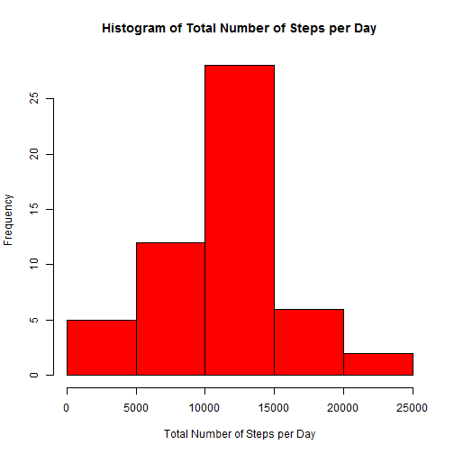
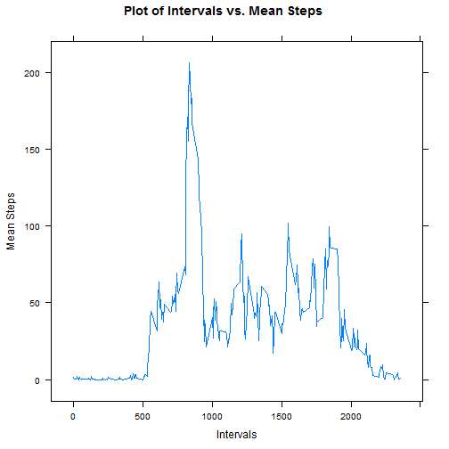
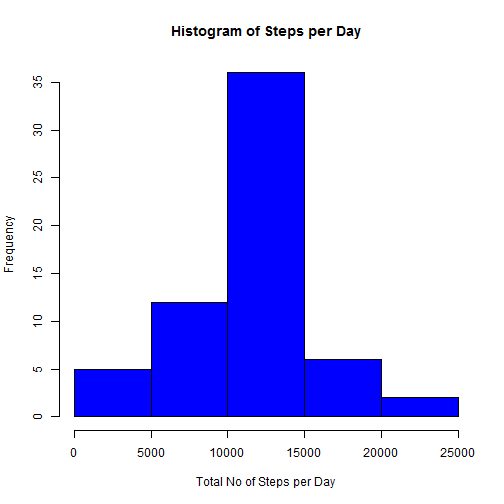
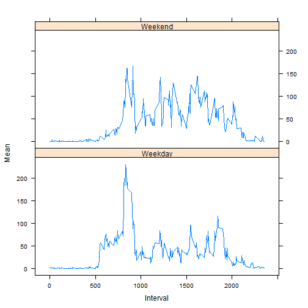

# Reproducible Research Peer Assignment - Markdown document. 

## Loading Libraries

```r
library(lattice)
library(plyr)
```


## Loading and preprocessing the data

```r
act <- read.csv("activity.csv", header = TRUE, sep = ",")
summary(act)
```

```
##      steps               date          interval   
##  Min.   :  0.0   2012-10-01:  288   Min.   :   0  
##  1st Qu.:  0.0   2012-10-02:  288   1st Qu.: 589  
##  Median :  0.0   2012-10-03:  288   Median :1178  
##  Mean   : 37.4   2012-10-04:  288   Mean   :1178  
##  3rd Qu.: 12.0   2012-10-05:  288   3rd Qu.:1766  
##  Max.   :806.0   2012-10-06:  288   Max.   :2355  
##  NA's   :2304    (Other)   :15840
```

```r
dim(act)
```

```
## [1] 17568     3
```

```r
names(act)
```

```
## [1] "steps"    "date"     "interval"
```

```r

# changing the class of the variable 'steps' to be Numeric:
act$steps <- as.numeric(act$steps)

# changing the class of the variable 'interval' to be Numeric:
act$interval <- as.numeric(act$interval)

Actuals <- act[complete.cases(act), ]  # removing NAs.
```


## What is mean total number of steps taken per day?


### Make a histogram of the total number of steps taken each day

```r
smsteps <- ddply(Actuals, c("date"), function(x) apply(x[1], 2, sum))

hist(smsteps$steps, main = "Histogram of Total Number of Steps per Day", xlab = "Total Number of Steps per Day", 
    ylab = "Frequency", col = "red")
```

 

### Calculate and report the mean and median total number of steps taken per day 

```r

# mean of the steps
mean(smsteps$steps, na.rm = TRUE)
```

```
## [1] 10766
```

```r

# median of the steps
median(smsteps$steps, na.rm = TRUE)
```

```
## [1] 10765
```


## What is the average daily activity pattern?

### Make a time series plot of the 5-minute interval (x-axis) and the average number of steps taken, averaged across all days (y-axis)


```r

# Mean of the steps related to each interval
mnsteps <- ddply(Actuals, c("interval"), function(x) apply(x[1], 2, mean))

xyplot(mnsteps$steps ~ mnsteps$interval, type = "l", ylab = "Mean Steps", xlab = "Intervals", 
    main = "Plot of Intervals vs. Mean Steps", lwd = 1)
```

 


### Which 5-minute interval, on average across all the days in the dataset, contains the maximum number of steps?


```r
mnsteps[mnsteps$steps == max(mnsteps$steps), ]
```

```
##     interval steps
## 104      835 206.2
```


## Imputing missing values

### Calculate and report the total number of missing values in the dataset


```r

# number of missing rows in column 'steps'
sum(is.na(act$steps))
```

```
## [1] 2304
```

```r

# number of missing rows in column 'interval'
sum(is.na(act$interval))
```

```
## [1] 0
```

```r

# number of missing rows in column 'date'
sum(is.na(act$date))
```

```
## [1] 0
```

```r

# Replacing the steps of the rows having NAs with the mean steps for each
# 5-min interval across the all data:

# New dataset but with the missing values filled in

newData <- act
newData[1:288, 1] <- mnsteps$steps
newData[2017:2304, 1] <- mnsteps$steps
newData[8929:9216, 1] <- mnsteps$steps
newData[9793:10080, 1] <- mnsteps$steps
newData[11233:11520, 1] <- mnsteps$steps
newData[11521:11808, 1] <- mnsteps$steps
newData[12673:12960, 1] <- mnsteps$steps
newData[17281:17568, 1] <- mnsteps$steps

sum(is.na(newData))  # There is no NA.
```

```
## [1] 0
```

```r

newSum <- ddply(newData, c("date"), function(x) apply(x[1], 2, sum))

# Plot histogram with new set of activity data

hist(newSum$steps, main = "Histogram of Steps per Day", xlab = "Total No of Steps per Day", 
    ylab = "Frequency", col = "blue")
```

 

```r

# mean of the steps
newMean <- mean(newSum$steps)
newMean  #new mean with missing values fill in
```

```
## [1] 10766
```

```r
newMedian <- median(newSum$steps)
newMedian  # median of the steps with missing values fill in
```

```
## [1] 10766
```

```r

# there is no difference in new mean(missing values filled in) and old mean
# (with missing values) There is slight change in new median(missing values
# filled in)
```


##Are there differences in activity patterns between weekdays and weekends?


```r
# Add a new column name of the day(weekday or weekend)

newData$WD <- weekdays(as.Date(newData$date))

newData$WD[newData$WD == "Monday"] = "Weekday"
newData$WD[newData$WD == "Tuesday"] = "Weekday"
newData$WD[newData$WD == "Wednesday"] = "Weekday"
newData$WD[newData$WD == "Thursday"] = "Weekday"
newData$WD[newData$WD == "Fridayday"] = "Weekday"
newData$WD[newData$WD == "Friday"] = "Weekday"
newData$WD[newData$WD == "Saturday"] = "Weekend"
newData$WD[newData$WD == "Sunday"] = "Weekend"

table(newData$WD)
```

```
## 
## Weekday Weekend 
##   12960    4608
```

```r

new_mnsteps <- ddply(newData, c("interval", "WD"), function(x) apply(x[1], 2, 
    mean))

xyplot(new_mnsteps$steps ~ new_mnsteps$interval | new_mnsteps$WD, type = "l", 
    ylab = "Mean", xlab = "Interval", layout = c(1, 2))
```

 

